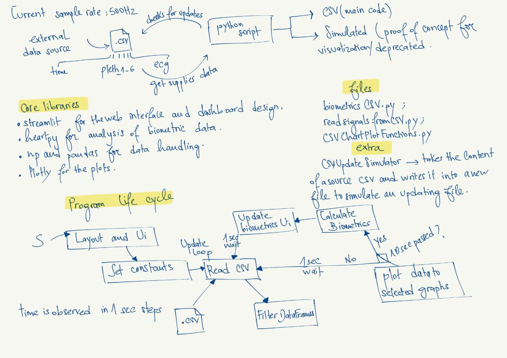

# Web app For Monitoring a Patient's Health Status in Real Time 

This is the second project i worked on during my internship as a Health Data scientist/ AI engineer at LIP6. The goal of the project was to create a dashboard to visualize and process in real time various data emanating from one or more CSV type files which are continuously filled during an acquisition in order to display various calculated physiologcial parameters notabely Heart Rate(HR), Breathing Rate(BR), Blood oxygen saturation(SpO2), and temperature(T) on the acquired signals.


## Authors

- [@Imaneelmissaoui](https://github.com/imaneelmissaoui)


## Demo
A demo can be visualized here : 
https://github.com/imaneelmissaoui/Real_time_Monitoring_Dashboard/blob/main/FinalDashboard_demo_video.mp4

The demo shows a clip of the real time dashboard streaming thats being updated while new data is being read from te the source csv file and written into the simulated csv file using the module CSVUpdateSimulator.py 


## Run Locally

Clone the project

```bash
  git clone https://github.com/imaneelmissaoui/Real_time_Monitoring_Dashboard/tree/main/Dashboard/FinalDashboard
```

Go to the project directory

```bash
  cd /CSV 
```

Install dependencies

```bash
  pip install HeartPy
  pip install Streamlit 
  pip install Plotly 
```

Start the server

```bash
  streamlit run CSVDashboard.py 
```

```bash
  Python CSVUpdateSimulator.py 
```

## Erros and Bugs
- Some Biometrics might not be calculated accurately and need more accurate implementations.  
- Reading and writing periodically into the same file causes conflicts in which data can't be accessed properly.
- The Timings in the CSV(Time column) aren't taken into consideration for a more accurate signal. Currently we rely on a constant sampling rate(500Hz).
- Streamlit "resets" when data is updated and redraws everything instead of just updating the already existing elements.
- Signal filtering can be improved later and updated to each signal instead of a generic filtering on the type of teh signal(PPG).
- Blood Oxygen also generates negative values, management of these aberrant values need to be iplemented later. 

## Screenshots


## Dashboard Workflow

The dashboard workflow can be visualized here : 

